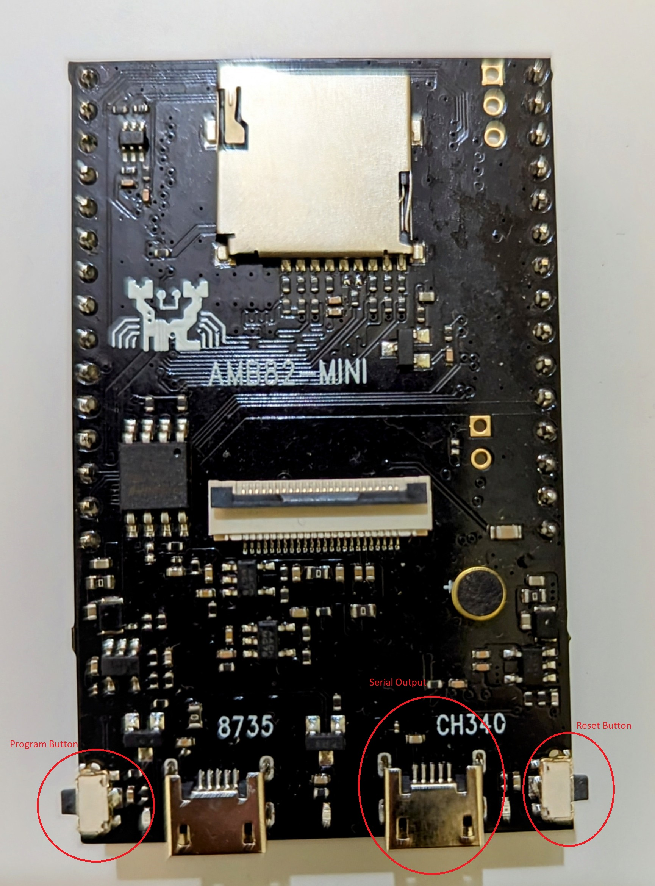

# FreeRTOS-WebRTC

## Ameba Pro2 Mini


## Clone
Execute the following commands to clone this repository along with all the
submodules-
```sh
git clone https://github.com/ActoryOu/FreeRTOS-WebRTC.git
cd FreeRTOS-WebRTC
git submodule update --init --recursive
```

## Setup
1. Copy `examples/master/demo_config_template.h` and rename it to `examples/master/demo_config.h` and set the following:
   * Set `AWS_KVS_CHANNEL_NAME` to your signaling channel name.
   * Set `AWS_ACCESS_KEY_ID` to your access key.
   * Set `AWS_SECRET_ACCESS_KEY` to your secret access key.
1. Setup toolchain:
   ```sh
   cd libraries/ambpro2_sdk/tools
   cat asdk-10.3.0-linux-newlib-build-3633-x86_64.tar.bz2.* | tar jxvf -
   pwd
   <!-- Copy this absolute path  -->
   export PATH=($COPIED_PATH)/asdk-10.3.0/linux/newlib/bin:$PATH
   ```
1. Connect the board to the PC using the CH340 micro USB port (marked as "Serial
   Output" in the above image).

## Build
1. Open terminal and change directory to the project location:
   ```sh
   cd project/realtek_amebapro2_webrtc_application/GCC-RELEASE
   ```
1. Create `build` directory and enter `build` directory:
   ```sh
   mkdir build
   cd build
   ```
1. Run the following command to generate Makefile:
   ```sh
   cmake .. -G"Unix Makefiles" -DCMAKE_TOOLCHAIN_FILE=../toolchain.cmake
   ```
1. Run the following command to build:
   ```sh
   cmake --build . --target flash
   ```

## Flash
### Copy Flash Tool [Needed only one time]
1. Unzip the flash tool:
   ```shell
   cd libraries/ambpro2_sdk/tools/
   unzip Pro2_PG_tool _v1.3.0.zip
   ```
   **Note: If you're using MAC, please find repo owner to get Pro2_PG_tool+_v1.4.3_B.zip.**
1. Copy the contents of `libraries/ambpro2_sdk/tools/Pro2_PG_tool _v1.3.0` to
   a directory in the Windows file system.

### Flash Binary
1. Close TeraTerm if it is running and connected to the board.
1. Copy the generated binary `project/realtek_amebapro2_webrtc_application/GCC-RELEASE/build/flash_ntz.bin`
   to the directory in the Windows file system which contains the flash tool
   from the [Copy Flash Tool](#copy-flash-tool-needed-only-one-time) section.
1. Open a terminal (such as PowerShell) and enter the directory in the
   Windows file system which contains the flash tool from the
   [Copy Flash Tool](#copy-flash-tool-needed-only-one-time) section.
1. Enter the board into program mode:
   * Press the Reset button.
   * Press the Program button while keeping the Reset button pressed.
   * Release the Reset button.
   * Release the Program button.
1. Run the following command in the terminal (such as PowerShell) to
   flash the binary:
   * Windows:
      ```sh
      .\uartfwburn.exe -p COMxx -f flash_ntz.bin -b 2000000 -U
      ```
      Replace COMxx with the actual COM port that you can find in the Device Manager.
   * Mac: 
      ```sh
      chmod +x uartfwburn.arm.darwin 
      sudo ./uartfwburn.arm.darwin -p /dev/cu.usbserial-**** -f ./flash_ntz.bin -b 2000000 -U
      ```
      Replace /dev/cu.usbserial-**** with the actual COM port that you can find by running: 
      ```sh
      ls /dev/cu.*
      ```

## Run
### Set up WiFi [Needed only one time]
1. Open TeraTerm and connect to the COM port.
1. Press and release the Reset button.
1. Send the following commands to the device using TeraTerm to setup WiFi SSID
   and Password:
   ```sh
   ATW0=<ssid>
   ATW1=<password>
   ATWC
   ```

### Run the Program
1. Open TeraTerm and connect to the COM port.
1. Press and release the Reset button.

## Troubleshooting

1. Permission denied while accessing `project/realtek_amebapro2_webrtc_application/GCC-RELEASE/mp/*.linux`.
   Run the following command to add execute permission:
   ```sh
   chmod +x project/realtek_amebapro2_webrtc_application/GCC-RELEASE/mp/*.linux
   ```
